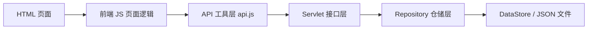
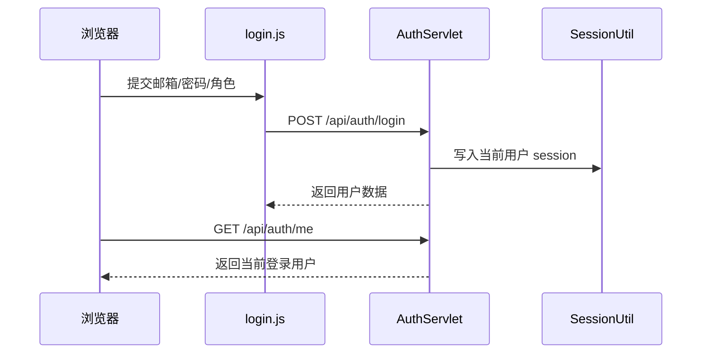
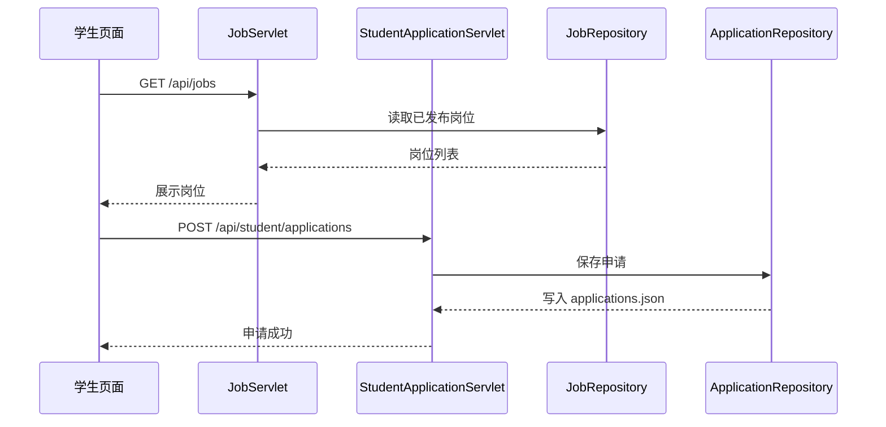
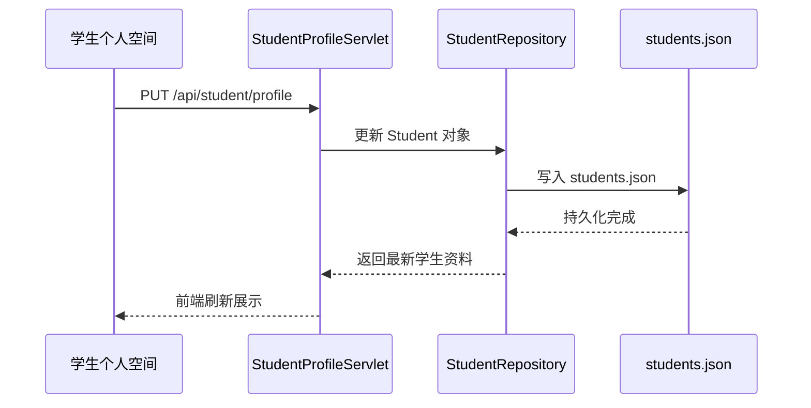
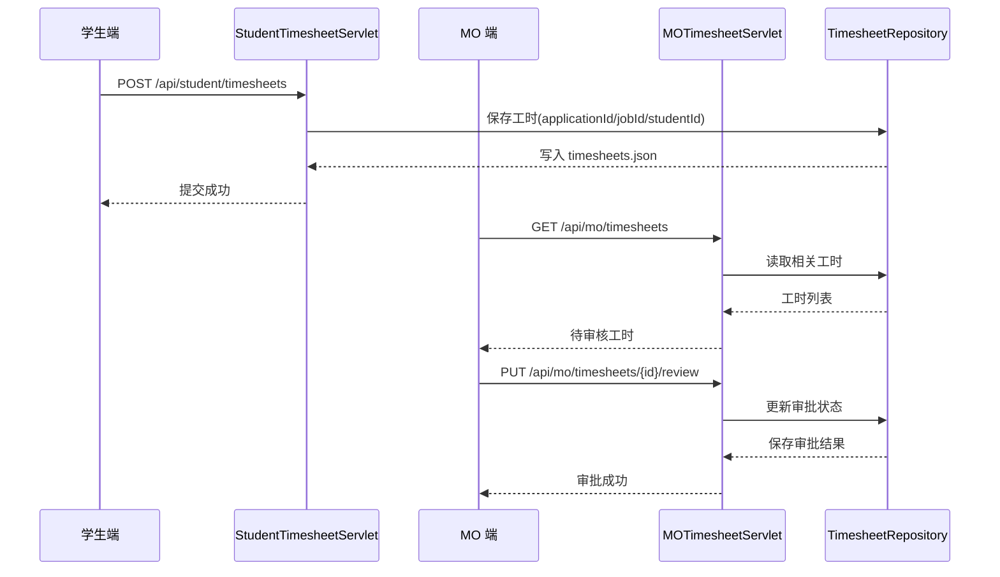
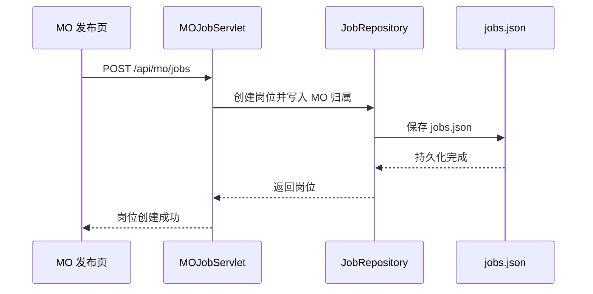

# BUPT IS TA Recruitment System 学生端与 MO 端验收说明

## 1. 文档目的

本文档用于对项目当前已经完成的 **学生端** 与 **MO 端（Module Organiser）** 功能进行系统性说明，方便课程展示、功能验收与答辩讲解。

文档重点包括：

- 当前项目的整体架构设计思路
- 学生端与 MO 端的业务功能清单
- 每项功能涉及的关键文件、实现思路与优点
- 前后端数据链路与端到端业务闭环
- 当前演示数据配置与建议演示路径
- 当前边界与未纳入本次验收的部分

说明：

- 本文档以当前仓库代码为准。
- 本次说明重点覆盖 **学生端** 与 **MO 端**。
- **AI 相关功能不纳入本次验收重点**。
- Admin 端目前不是本项目最完整的实现部分，因此本文仅在必要处提及，不作为重点展开。

---

## 2. 项目总体定位

本项目是一个面向教学助理招聘场景的 Web 系统，核心目标是把以下角色串联起来：

- 学生：浏览岗位、投递申请、维护个人资料、上传简历、提交工时
- MO：查看自己负责课程、发布岗位、审核申请、审核工时

项目当前采用的是一套 **轻量级、可演示、易验收** 的架构方案：

- 后端基于 Java 17
- 服务启动方式为内嵌 `HttpServer`
- 接口风格使用 Servlet 方式封装
- 数据持久化使用 JSON 文件
- 前端使用原生 HTML + CSS + JavaScript

这种方案的特点是：

- 结构清晰，便于课程项目展示
- 不依赖复杂数据库与大型框架，部署门槛低
- 数据链路完整，可演示真实业务闭环
- 适合在有限周期内完成端到端原型和验收

---

## 3. 架构设计思路

## 3.1 总体架构

系统可以概括为四层：

1. 页面展示层
2. 前端交互层
3. 后端接口层
4. 数据持久化层

对应关系如下：

---

## 3.2 后端架构设计

### 3.2.1 内嵌服务器入口

核心入口文件：

- `src/EmbeddedServer.java`

职责：

- 启动内嵌 `HttpServer`
- 注册各类 API 路由
- 将请求交给对应的 Servlet
- 提供静态资源访问能力

当前已经注册的主要接口包括：

- `/api/auth`
- `/api/jobs`
- `/api/student/profile`
- `/api/student/applications`
- `/api/student/timesheets`
- `/api/mo/jobs`
- `/api/mo/applicants`
- `/api/mo/timesheets`
- `/api/mo/modules`

设计优点：

- 启动简单，项目演示成本低
- 不依赖外部 Tomcat/Jetty 容器
- 对课程项目非常友好，结构可控、便于调试

---

### 3.2.2 DDD 风格的目录设计

后端目录按领域划分，主要分为：

- `shared`
- `student`
- `mo`

其中每个领域基本采用以下分层思路：

- `domain`：领域对象
- `interfaces`：接口层/控制器层
- `infrastructure`：仓储与持久化
- `application`：预留应用服务层

示例目录：

- `src/com/bupt/ta/shared/domain`
- `src/com/bupt/ta/shared/infrastructure`
- `src/com/bupt/ta/shared/interfaces`
- `src/com/bupt/ta/student/interfaces`
- `src/com/bupt/ta/mo/interfaces`

这说明项目采用的是一种 **DDD-inspired（DDD 思路驱动）** 的轻量分层，而不是完全重量级的企业级 DDD。

其核心思想是：

- 先用领域对象表达业务核心数据
- 用仓储隔离数据读写
- 用接口层处理 HTTP 请求与响应
- 用分领域目录提升可维护性

优点：

- 业务边界清楚，学生端与 MO 端职责隔离
- 数据模型集中定义，前后端联调时更容易定位问题
- 后期如需加数据库或 Service 层，迁移成本较低

当前特点：

- `application` 层目前多为占位，业务逻辑主要落在 `interfaces + repository` 中
- 这对于课程项目是合理取舍：避免过度设计，同时保留清晰结构

---

### 3.2.3 共享基础设施

#### 1. BaseServlet

文件：

- `src/com/bupt/ta/shared/interfaces/BaseServlet.java`

作用：

- 作为所有 Servlet 的父类
- 封装通用 JSON 读写
- 提供登录校验、角色校验等基础能力

实现思路：

- 统一处理请求体解析
- 统一处理权限判断
- 让各业务 Servlet 只关注本身业务

优点：

- 避免重复代码
- 保证接口风格一致
- 降低后续扩展新接口的成本

#### 2. ResponseUtil

文件：

- `src/com/bupt/ta/shared/util/ResponseUtil.java`

作用：

- 统一接口返回格式

典型思路：

- 正常返回：`code + message + data`
- 错误返回：统一错误码与错误信息

优点：

- 前端处理逻辑统一
- 验收展示时接口行为更稳定

#### 3. SessionUtil

文件：

- `src/com/bupt/ta/shared/util/SessionUtil.java`

作用：

- 统一管理当前登录用户
- 管理 session 中的用户 id、角色等信息
- 支持登出失效

优点：

- 学生端和 MO 端都能共享同一套登录态机制
- 避免页面只靠 `localStorage` 判断登录，减少假登录问题

#### 4. DataStore

文件：

- `src/com/bupt/ta/shared/infrastructure/DataStore.java`

作用：

- 管理 JSON 文件的读写
- 管理持久化文件路径
- 对不同数据集合做统一加载与保存

当前数据文件：

- `resources/data/students.json`
- `resources/data/users.json`
- `resources/data/modules.json`
- `resources/data/jobs.json`
- `resources/data/applications.json`
- `resources/data/timesheets.json`

优点：

- 数据可直接查看，利于课程展示
- 无数据库依赖，环境准备简单
- 对小型项目来说足够直观

---

### 3.2.4 领域对象与仓储

#### 领域对象

核心领域模型位于：

- `src/com/bupt/ta/shared/domain/User.java`
- `src/com/bupt/ta/student/domain/Student.java`
- `src/com/bupt/ta/shared/domain/Job.java`
- `src/com/bupt/ta/shared/domain/Application.java`
- `src/com/bupt/ta/shared/domain/Timesheet.java`
- `src/com/bupt/ta/shared/domain/CourseModule.java`
- `src/com/bupt/ta/shared/domain/Resume.java`
- `src/com/bupt/ta/shared/domain/Schedule.java`

设计思路：

- 使用领域对象承载业务数据，而不是在接口层随意拼装
- 把“学生”“岗位”“申请”“工时”“课程模块”等关键概念显式建模

优点：

- 可读性强
- 业务语义清晰
- 适合讲解“系统如何围绕业务对象组织代码”

#### 仓储层

核心仓储位于：

- `src/com/bupt/ta/shared/infrastructure/StudentRepository.java`
- `src/com/bupt/ta/shared/infrastructure/UserRepository.java`
- `src/com/bupt/ta/shared/infrastructure/ModuleRepository.java`
- `src/com/bupt/ta/shared/infrastructure/JobRepository.java`
- `src/com/bupt/ta/shared/infrastructure/ApplicationRepository.java`
- `src/com/bupt/ta/shared/infrastructure/TimesheetRepository.java`

设计思路：

- 将“数据如何读写 JSON 文件”的逻辑集中到仓储层
- 让接口层更多关注业务规则，而不是文件读写细节

优点：

- 符合 DDD 中 Repository 的思路
- 如果以后换成数据库，改动集中在仓储层
- 有利于业务接口复用

---

## 3.3 前端架构设计

前端采用 **页面驱动 + 公共工具层** 的设计。

### 3.3.1 页面文件

学生端主要页面：

- `web/index.html`
- `web/apply.html`
- `web/job-detail.html`
- `web/about.html`
- `web/announcements.html`
- `web/guide.html`
- `web/student/dashboard.html`
- `web/login.html`

MO 端主要页面：

- `web/mo/index.html`
- `web/mo/jobs.html`
- `web/mo/post-job.html`
- `web/mo/applicants.html`
- `web/mo/timesheets.html`

### 3.3.2 公共 JS 工具

关键文件：

- `web/static/js/utils/api.js`
- `web/static/js/utils/auth.js`

设计思路：

- `api.js` 统一封装所有接口访问
- `auth.js` 统一处理登录态同步、退出登录、前端显示状态

优点：

- 页面脚本无需重复写 fetch 逻辑
- 接口变更时，集中维护
- 页面更聚焦于展示逻辑与用户交互

### 3.3.3 页面脚本

学生端页面脚本：

- `web/static/js/pages/student/apply.js`
- `web/static/js/pages/student/dashboard.js`
- `web/static/js/pages/student/announcements.js`
- `web/static/js/pages/student/guide.js`

MO 端页面脚本：

- `web/static/js/pages/mo/common.js`
- `web/static/js/pages/mo/dashboard.js`
- `web/static/js/pages/mo/jobs.js`
- `web/static/js/pages/mo/post-job.js`
- `web/static/js/pages/mo/applicants.js`
- `web/static/js/pages/mo/timesheets.js`

设计特点：

- 页面脚本与页面职责一一对应
- 功能边界比较清晰，便于排错
- 页面之间通过公共工具层共享认证与请求能力

---

## 4. 当前演示数据配置

为了方便验收，当前项目已经整理为 **单学生 + 单 MO + 单 Admin** 的演示模式。

### 4.1 固定账号

#### 学生端

- 账号：`student@bupt.edu.cn`
- 密码：`123456`

#### MO 端

- 账号：`mo@bupt.edu.cn`
- 密码：`123456`

#### Admin 端

- 账号：`admin@bupt.edu.cn`
- 密码：`123456`

对应数据文件：

- `resources/data/students.json`
- `resources/data/users.json`

### 4.2 课程与岗位归属

当前所有课程都归属于同一个 MO：

- `MO001`

对应课程数据：

- `resources/data/modules.json`

当前所有岗位也都由这个 MO 发布：

- `resources/data/jobs.json`

这样做的好处是：

- 学生端看到的岗位，MO 端一定能管理
- 学生投递的申请，MO 端一定能审核
- 学生提交的工时，MO 端一定能审批
- 演示链路完整，避免“数据属于多个账号导致展示分散”

### 4.3 当前业务数据状态

当前数据集中已经包含：

- 多个已发布岗位
- 一个 draft 岗位
- 一个 pending 申请
- 一个 approved 申请
- 一个 withdrawn 申请
- 一个 rejected 申请
- 已提交并待审核、已审核的工时记录

这使得展示时可以直接看到不同业务状态，而不必临时造数据。

---

## 5. 学生端功能详解

## 5.1 学生端总体设计目标

学生端的目标不是只做“浏览页面”，而是完成一个相对完整的学生招聘流程闭环：

1. 登录/注册
2. 浏览岗位
3. 查看详情
4. 投递申请
5. 在个人空间维护资料、简历、课表
6. 跟踪申请状态
7. 对已录用岗位提交工时

这条链路与 MO 端天然对应，形成完整业务闭环。

---

## 5.2 登录与注册

涉及文件：

- 前端：`web/login.html`
- 前端脚本：`web/static/js/pages/login.js`
- 公共认证：`web/static/js/utils/auth.js`
- 后端接口：`src/com/bupt/ta/shared/interfaces/AuthServlet.java`
- 会话工具：`src/com/bupt/ta/shared/util/SessionUtil.java`

实现思路：

- 登录通过 `/api/auth/login`
- 学生注册通过 `/api/auth/register`
- 登录成功后由后端写入 session
- 前端通过 `/api/auth/me` 校验当前登录态
- 页面头部、页脚、入口按钮根据真实 session 切换显示

当前实现特点：

- 学生可登录，也可自助注册
- 注册后会直接生成学生记录并自动登录
- 登出会真正调用后端接口失效 session

优点：

- 不再是单纯前端伪登录
- 登录态在公共页、学生页、MO 页中保持一致
- 适合展示“认证状态是有后端支撑的”

---

## 5.3 首页与公共页联动

涉及文件：

- `web/index.html`
- `web/about.html`
- `web/announcements.html`
- `web/guide.html`
- `web/static/js/utils/auth.js`

实现思路：

- 公共页共享统一 header/footer
- 根据 `auth.js` 中的登录态同步结果，动态显示：
  - 未登录：`Student Login / Staff Entrance`
  - 已登录学生：`My Dashboard / Logout`

优点：

- 站点观感一致
- 用户不会在公共页和个人页之间产生割裂感

说明：

- `Announcements` 当前是静态展示内容，不是动态公告系统
- 这属于“静态内容页”，不是损坏功能

---

## 5.4 岗位浏览 Apply 页面

涉及文件：

- 页面：`web/apply.html`
- 脚本：`web/static/js/pages/student/apply.js`
- 公共接口：`web/static/js/utils/api.js`
- 后端岗位接口：`src/com/bupt/ta/shared/interfaces/JobServlet.java`
- 数据源：`resources/data/jobs.json`

实现思路：

- 页面通过 `/api/jobs` 拉取公开岗位
- 支持关键词搜索
- 支持基于前端数据的筛选
- 根据学生课表，对岗位时间安排进行冲突检测
- 收藏功能按当前学生维度保存在本地

核心实现点：

1. 真实读取后端返回的岗位数据
2. 不再依赖不存在的 mock 字段
3. 基于学生课表计算 `hasConflict`
4. 收藏数据按学生隔离，避免不同学生串数据

优点：

- 页面和真实后端数据模型对齐
- 学生在申请前能提前感知课表冲突
- 收藏功能适合作为前端增强能力，不影响主业务链

---

## 5.5 岗位详情 Job Detail

涉及文件：

- 页面：`web/job-detail.html`
- 公共接口：`web/static/js/utils/api.js`
- 学生申请接口：`src/com/bupt/ta/student/interfaces/StudentApplicationServlet.java`

实现思路：

- 通过岗位 id 拉取单个岗位详情
- 展示岗位说明、职责、要求、时间安排等信息
- 支持直接从详情页发起申请
- 同样进行课表冲突提示

当前实现改进点：

- 对空 `requirements` 做了兜底处理
- 申请失败会提示明确错误，而不是静默失败
- 详情页字段与后端 `Job` 模型已对齐

优点：

- 详情页不是单纯静态页面，而是真实业务入口
- 与 Apply 页形成浏览到投递的自然过渡

---

## 5.6 学生申请管理

涉及文件：

- 页面：`web/student/dashboard.html`
- 脚本：`web/static/js/pages/student/dashboard.js`
- 接口：`src/com/bupt/ta/student/interfaces/StudentApplicationServlet.java`
- 仓储：`src/com/bupt/ta/shared/infrastructure/ApplicationRepository.java`
- 数据：`resources/data/applications.json`

实现思路：

- 学生申请通过 `/api/student/applications` 创建
- 个人中心加载自己的申请列表
- 显示状态、时间线、岗位信息
- 支持撤回 `pending` 状态申请

状态设计：

- `pending`
- `approved`
- `rejected`
- `withdrawn`

优势：

- 状态枚举已经和后端统一
- 时间线能直观展示申请流转过程
- 形成了学生视角下的“申请进度看板”

---

## 5.7 个人资料维护

涉及文件：

- 页面：`web/student/dashboard.html`
- 脚本：`web/static/js/pages/student/dashboard.js`
- 后端：`src/com/bupt/ta/student/interfaces/StudentProfileServlet.java`
- 数据：`resources/data/students.json`

可维护字段包括：

- 手机号
- 专业
- 年级
- 个人简介
- GPA
- 头像
- 技能标签

实现思路：

- 前端统一通过 `PUT /api/student/profile` 保存
- 后端对学生对象进行字段级更新
- 保存后立刻刷新视图

优点：

- 从“只写本地缓存”升级为真实后端持久化
- 页面刷新后数据仍保留
- 多功能统一走同一接口，结构简洁

---

## 5.8 简历功能

涉及文件：

- 页面：`web/student/dashboard.html`
- 脚本：`web/static/js/pages/student/dashboard.js`
- 后端：`src/com/bupt/ta/student/interfaces/StudentProfileServlet.java`
- 领域对象：`src/com/bupt/ta/shared/domain/Resume.java`
- 数据：`resources/data/students.json`

当前简历分为两类：

### 1. 标准表单简历

实现方式：

- 学生通过表单填写教育经历、项目/经历、奖励等
- 保存后写入学生资料中的 `resume` 和 `skills`

优点：

- 数据结构化，便于后续做匹配或展示
- 适合课程项目中展示“系统理解简历结构”的能力

### 2. PDF 简历上传

实现方式：

- 上传后的文件内容以数据方式保存在学生资料中
- 后端字段包括：
  - `resumePdfName`
  - `resumePdfData`
  - `resumePdfUploadedAt`

实现特点：

- 上传后无需审批
- 上传完成即可在个人空间中查看当前状态
- 刷新页面后仍然能看到

优点：

- 符合用户真实预期：“上传即生效”
- 与结构化简历并存，兼顾灵活性与可展示性

---

## 5.9 课表管理

涉及文件：

- 页面：`web/student/dashboard.html`
- 脚本：`web/static/js/pages/student/dashboard.js`
- 后端：`src/com/bupt/ta/student/interfaces/StudentProfileServlet.java`
- 领域对象：`src/com/bupt/ta/shared/domain/Schedule.java`

实现思路：

- 学生可以维护个人课表
- 支持导入 CSV 格式课表数据
- 课表数据保存到学生资料中

与业务的关系：

- Apply 页和 Job Detail 页会读取学生课表
- 根据岗位时间安排做冲突检测

优点：

- 课表不再是孤立功能，而是参与岗位匹配判断
- 体现了“学生画像数据驱动招聘交互”的设计思路

---

## 5.10 工时提交

涉及文件：

- 页面：`web/student/dashboard.html`
- 脚本：`web/static/js/pages/student/dashboard.js`
- 后端：`src/com/bupt/ta/student/interfaces/StudentTimesheetServlet.java`
- 仓储：`src/com/bupt/ta/shared/infrastructure/TimesheetRepository.java`
- 数据：`resources/data/timesheets.json`

实现思路：

- 学生仅能对已通过的申请对应岗位提交工时
- 提交时会写入：
  - `studentId`
  - `jobId`
  - `applicationId`
  - 日期
  - 工时
  - 工作描述

关键意义：

- `applicationId` 已写入工时记录
- 这样 MO 端可以基于申请关系找到并审核该工时

优点：

- 打通了学生端到 MO 端的工时闭环
- 工时模块不再是孤立演示页面，而是真实业务链的一部分

---

## 5.11 安全设置

涉及文件：

- 页面：`web/student/dashboard.html`
- 脚本：`web/static/js/pages/student/dashboard.js`
- 后端：`src/com/bupt/ta/student/interfaces/StudentProfileServlet.java`

实现思路：

- 通过 `currentPassword + newPassword` 更新密码
- 后端校验当前密码是否正确
- 校验新密码长度后再保存

优点：

- 安全设置不是纯展示，而是实际写回用户数据
- 与资料更新统一在同一 profile 接口里完成，结构简洁

---

## 5.12 学生端总结

学生端当前已经形成了相对完整的业务闭环：

1. 登录/注册
2. 浏览岗位
3. 查看详情并申请
4. 查看与撤回申请
5. 维护个人资料
6. 管理简历
7. 管理课表
8. 提交工时
9. 退出登录

这使学生端不再是“静态展示页面集合”，而是具备真实业务流转能力的前端子系统。

---

## 6. MO 端功能详解

## 6.1 MO 端总体设计目标

MO 端的目标是支持一个课程负责人完成与自己课程相关的招聘与协同管理：

1. 查看自己负责的模块
2. 创建并发布 TA 岗位
3. 查看申请人并审核
4. 查看并审核工时
5. 通过看板和导出快速掌握整体情况

当前项目已将所有课程和岗位都归属到同一个 MO 账号下，便于完整演示这一流程。

---

## 6.2 MO 登录与会话识别

涉及文件：

- 前端：`web/login.html`
- 脚本：`web/static/js/pages/login.js`
- 公共认证：`web/static/js/utils/auth.js`
- 后端：`src/com/bupt/ta/shared/interfaces/AuthServlet.java`
- 会话工具：`src/com/bupt/ta/shared/util/SessionUtil.java`

实现思路：

- MO 与学生共用登录入口
- 通过角色选择进入不同工作台
- 登录后 session 中写入 MO 身份
- MO 页面通过 `auth.js` 与 `common.js` 做会话校验与登出

优点：

- 单一认证入口，体验统一
- 角色分流清晰

---

## 6.3 MO Dashboard 总览页

涉及文件：

- 页面：`web/mo/index.html`
- 脚本：`web/static/js/pages/mo/dashboard.js`
- 接口：`src/com/bupt/ta/mo/interfaces/MOApplicantServlet.java`
- 数据：`resources/data/applications.json`、`resources/data/jobs.json`

实现内容：

- 统计自己岗位下的申请总数
- 展示 pending / approved / rejected 等状态概览
- 支持筛选
- 支持导出当前筛选结果

实现思路：

- Dashboard 并不是单独维护一份“统计表”
- 而是通过申请数据与岗位归属关系实时计算

优点：

- 数据源一致，避免统计与明细不一致
- 非常适合验收时展示“总览和详情是对得上的”

---

## 6.4 My Modules 模块总览

涉及文件：

- 页面：`web/mo/jobs.html`
- 脚本：`web/static/js/pages/mo/jobs.js`
- 后端：`src/com/bupt/ta/mo/interfaces/MOModuleServlet.java`
- 数据：`resources/data/modules.json`

实现思路：

- MO 只能查看属于自己的课程模块
- 页面展示模块信息与其关联岗位概览

当前关键点：

- 后端兼容了 `moId` 和 `coordinatorId` 归属字段
- 即使存在旧数据字段，也能正确归到当前 MO

优点：

- 模块展示与岗位管理形成业务关联
- 便于讲解“课程模块是岗位发布的上游对象”

---

## 6.5 Post Job 岗位发布与编辑

涉及文件：

- 页面：`web/mo/post-job.html`
- 脚本：`web/static/js/pages/mo/post-job.js`
- 后端：`src/com/bupt/ta/mo/interfaces/MOJobServlet.java`
- 仓储：`src/com/bupt/ta/shared/infrastructure/JobRepository.java`
- 数据：`resources/data/jobs.json`

功能包括：

- 新建岗位
- 保存为草稿
- 编辑草稿
- 发布岗位
- 删除岗位

实现思路：

- 岗位创建时自动写入当前 MO 的 `moId / moName / createdBy`
- 同步保存岗位所属模块、岗位职责、要求、技能、时段、人数等字段
- `draft` 与 `published` 状态在前后端统一维护

关键实现点：

- `slots` 与 `positions` 做了同步
- 编辑时补齐了 `moduleId`、`department`、`type`、`requiredSkills`、`hourlyRate`、`schedule` 等字段映射

优点：

- 岗位数据完整度较高
- 岗位从创建到发布构成清晰生命周期
- 当前结构下 MO 对岗位拥有直接控制权，符合业务逻辑

---

## 6.6 Applicants 申请人审核

涉及文件：

- 页面：`web/mo/applicants.html`
- 脚本：`web/static/js/pages/mo/applicants.js`
- 后端：`src/com/bupt/ta/mo/interfaces/MOApplicantServlet.java`
- 仓储：
  - `src/com/bupt/ta/shared/infrastructure/ApplicationRepository.java`
  - `src/com/bupt/ta/shared/infrastructure/JobRepository.java`
  - `src/com/bupt/ta/shared/infrastructure/StudentRepository.java`
- 数据：`resources/data/applications.json`

实现思路：

- MO 只能看到自己岗位上的申请
- 后端先根据 `createdBy` 找到当前 MO 发布的岗位
- 再过滤出这些岗位对应的申请
- 同时补齐学生信息与岗位信息返回给前端

审核功能：

- 批准申请
- 拒绝申请
- 记录审核人、审核时间、审核备注
- 补充申请时间线

状态设计：

- `pending`
- `approved`
- `rejected`

优点：

- 权限边界清楚，MO 无法跨岗位管理别人的申请
- 申请状态和时间线与学生端联动
- 适合展示“同一条申请记录在两个角色端如何协同变化”

---

## 6.7 Timesheets 工时审核

涉及文件：

- 页面：`web/mo/timesheets.html`
- 脚本：`web/static/js/pages/mo/timesheets.js`
- 后端：`src/com/bupt/ta/mo/interfaces/MOTimesheetServlet.java`
- 仓储：
  - `src/com/bupt/ta/shared/infrastructure/TimesheetRepository.java`
  - `src/com/bupt/ta/shared/infrastructure/ApplicationRepository.java`
  - `src/com/bupt/ta/shared/infrastructure/JobRepository.java`
- 数据：`resources/data/timesheets.json`

实现思路：

- MO 只能审核自己岗位相关的工时
- 工时记录通过 `applicationId` 与已通过申请关联
- 后端据此校验当前 MO 是否有权限审核

审核功能：

- 查看工时明细
- 批准/拒绝
- 填写审核备注
- 记录审核时间、审核人、审批工时数
- 导出工时 CSV

关键规则：

- 只能审核 `pending` 状态工时
- `approvedHours` 不能为负数
- `approvedHours` 不能超过学生申报工时

优点：

- 规则明确，防止无效审批数据
- 学生端提交与 MO 端审批形成完整闭环
- 导出功能有利于展示“系统支持管理动作，而不只是看页面”

---

## 6.8 MO 端总结

MO 端当前已经完成的核心业务链如下：

1. 登录进入 MO 工作台
2. 查看自己负责的课程模块
3. 创建/编辑/发布岗位
4. 查看并审核学生申请
5. 查看并审核学生工时
6. 从 Dashboard 和导出结果中掌握整体情况

这意味着 MO 端已经不是 mock 原型，而是具备实际业务处理能力的管理端子系统。

---

## 7. 核心数据链路说明

这一部分是验收展示时最重要的内容之一，因为它能说明系统不是“页面拼出来的”，而是真正有端到端数据流。

## 7.1 登录链路

意义：

- 登录态由后端 session 决定
- 前端通过 `/api/auth/me` 校验真实状态
- 页面切换后仍能维持登录状态

---

## 7.2 学生申请岗位链路

落地文件：

- `web/static/js/pages/student/apply.js`
- `web/job-detail.html`
- `src/com/bupt/ta/student/interfaces/StudentApplicationServlet.java`
- `resources/data/applications.json`

---

## 7.3 简历与资料保存链路

涉及内容：

- 基础资料
- GPA
- 头像
- skills
- 标准表单简历
- PDF 简历
- 课表
- 密码修改

---

## 7.4 工时链路

关键点：

- `applicationId` 是学生端与 MO 端工时流转的关键桥梁
- 没有这个字段，MO 端无法正确识别工时归属关系

---

## 7.5 MO 发布岗位链路

关键点：

- 创建岗位时自动写入当前 MO 身份
- 后续申请审核和工时审核都依赖这个归属关系

---

## 8. 为什么说当前实现“合理且可验收”

## 8.1 业务闭环已经形成

学生端与 MO 端之间不是孤立页面，而是形成了以下真实链路：

- 学生浏览岗位
- 学生投递申请
- MO 审核申请
- 学生查看结果
- 学生提交工时
- MO 审核工时

这已经具备完整的业务生命周期。

## 8.2 前后端数据模型已经对齐

在本轮整理中，已经重点修复了以下常见课程项目问题：

- 前端字段和后端模型不一致
- 页面只改本地缓存，没有真实持久化
- 申请状态与展示状态不一致
- 工时提交流程断链
- 页面能显示但不走真实后端

当前学生端与 MO 端的核心功能，已经尽可能对齐到真实数据模型。

## 8.3 DDD 思路清晰，且没有过度设计

项目不是简单把所有逻辑塞进一个类或一个脚本，而是采用了领域边界清晰的组织方式：

- shared 负责公共模型和基础设施
- student 负责学生业务
- mo 负责 MO 业务

虽然 application 层当前较轻，但整体思路是清楚的，适合课程验收时说明“系统是如何围绕业务领域设计的”。

---

## 9. 当前边界与说明

以下内容建议在答辩时主动说明，既诚实，也能体现你对项目边界有清晰认识。

### 9.1 AI 功能不纳入本次重点验收

AI 相关接口和页面存在，但本次说明不将其作为主线功能。

原因：

- 当前项目最成熟、最完整的是学生端与 MO 端核心业务链
- 验收更适合聚焦真实闭环，而不是实验性扩展功能

### 9.2 Admin 端不是当前最完整的子系统

Admin 端有部分页面与入口，但就代码完成度和业务闭环程度而言，不如学生端和 MO 端成熟。

因此：

- 可作为扩展方向简要提及
- 不建议作为主要演示重点

### 9.3 公告页目前是静态内容

`Announcements` 当前不是后端驱动的公告系统，而是静态展示页。

这不影响学生招聘主流程，但需要在说明时说清楚，避免老师误以为这是动态公告模块。

---

## 10. 建议的现场演示路径

为了让验收最顺畅，建议按照以下顺序演示。

### 路径一：学生主流程

1. 进入首页，展示公共页统一 header/footer
2. 学生登录
3. 进入 `Apply` 浏览岗位
4. 点开 `Job Detail`
5. 发起申请
6. 进入个人空间查看申请状态
7. 展示资料、简历、课表
8. 提交一条工时

### 路径二：MO 主流程

1. MO 登录
2. 展示 Dashboard 统计
3. 展示 `My Modules`
4. 展示 `Post Job` 中的 draft 和 published 岗位
5. 打开 `Applicants` 审核学生申请
6. 打开 `Timesheets` 审核工时
7. 演示导出功能

### 路径三：闭环强调

最后强调以下几点：

- 学生投递的岗位属于同一个 MO
- MO 能看到并审核这些申请
- 学生提交的工时，MO 能审核
- 所有数据在 JSON 中真实落库

---

## 11. 总结

从当前完成度来看，本项目的学生端与 MO 端已经实现了一个较完整的 TA 招聘业务闭环，并具备以下特点：

- 架构上采用轻量 DDD 思路，分层清楚
- 前后端数据链路真实存在
- 学生端功能覆盖申请、资料、简历、课表、工时
- MO 端功能覆盖模块、岗位、申请审核、工时审核
- 当前演示数据已整理为便于验收的单账号闭环模式

如果从课程项目验收角度评价，这套实现的优势不在于“技术栈多复杂”，而在于：

- 业务链完整
- 页面与后端不是脱节的
- 数据可追踪、可解释、可演示
- 结构足够清晰，便于讲述设计思路

因此，学生端与 MO 端已经具备作为本项目核心验收内容进行展示的条件。

